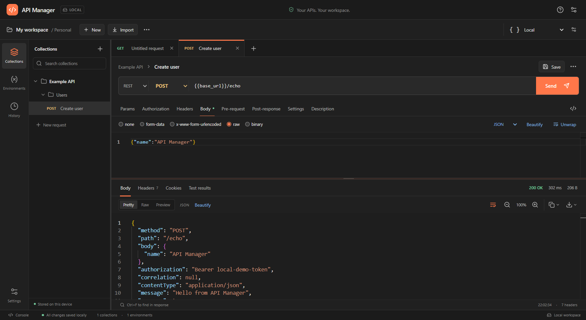

# API Manager

API Manager is an account-free desktop HTTP, REST, and SOAP client with familiar Postman-style collections, tabs, and editors. Collections, environments, globals, cookies, drafts, responses, and the latest 200 API runs stay on your computer. Your workspace resumes when the application reopens.

No API Manager login, cloud synchronization, or telemetry is required. Request authorization authenticates to **your API**. Network traffic consists of requests you explicitly send, including OAuth token requests. Editors, icons, and script libraries are bundled locally.



## Contents

- [Installation](#installation)
- [Build from source](#build-from-source)
- [First request](#first-request)
- [Tabs and editors](#tabs-and-editors)
- [Parameters, headers, and bodies](#parameters-headers-and-bodies)
- [SOAP](#soap)
- [Collections and folders](#collections-and-folders)
- [Environments, globals, and dynamic variables](#environments-globals-and-dynamic-variables)
- [Authorization](#authorization)
- [Pre-request and post-response scripts](#pre-request-and-post-response-scripts)
- [Response tools](#response-tools)
- [History and console](#history-and-console)
- [Cookies](#cookies)
- [Import and export](#import-and-export)
- [Settings and shortcuts](#settings-and-shortcuts)
- [Storage and recovery](#storage-and-recovery)
- [Troubleshooting](#troubleshooting)
- [Compatibility and limits](#compatibility-and-limits)
- [Development and verification](#development-and-verification)

## Installation

Windows x64 is the packaged target. Use a supported Windows version compatible with the bundled Electron runtime. Installed users do not need Node.js or npm.

### Download, unzip, and start

1. Download **API-Manager-1.0.0.zip** and save it to a folder on your computer.
2. Right-click the ZIP in File Explorer and choose **Extract All**. Open the extracted folder; run the application from this folder rather than from inside the ZIP.
3. Open the extracted **release** folder. For a normal installation, double-click **API Manager Setup 1.0.0.exe**, follow the installer, and open **API Manager** from its shortcut.
4. To run without installation, double-click **release/API Manager 1.0.0.exe** instead. Use one version at a time.
5. Make your first request using the steps below. Closing and reopening restores your local workspace.

The ZIP contains the complete source project: `src/`, `electron/`, `shared/`, `build/`, `tests/`, configuration files, `package.json`, `package-lock.json`, the built assets in `dist/`, and both Windows executables in `release/`. It also includes this README, the license, a `CHECKSUMS.txt` file for the executables, detailed guides in `docs/`, and importable examples in `examples/`. See [the example guide](examples/README.md) to try the optional local demonstration server.

Node.js is needed only for that demonstration server or building from source, not for installing or running the packaged application. Dependencies for source development are installed with `npm ci` using the included lockfile. The ZIP excludes generated dependency/cache folders, test profiles, Git history, and hosted CI metadata. All application source, build configuration, and local tests are included.

### Windows installer

1. Find **API Manager Setup 1.0.0.exe** in the extracted ZIP's **release** folder.
2. Run the setup executable, choose the installation directory, and follow the prompts.
3. Start **API Manager** from its desktop or Start menu shortcut.
4. The first launch opens an empty workspace. No signup is needed.

Builds are unsigned unless the owner supplies signing credentials; Windows may show an unknown publisher. Obtain builds from this repository or build from source.

### Portable version

Run **API Manager 1.0.0.exe** when a portable build is provided. It needs no installer. Workspace data still uses the Windows application data folder, rather than a directory beside the executable. Transfer the workspace using a backup export/import.

### Upgrade and uninstall

Export a backup and close API Manager before installing an upgrade. Application binaries and workspace data are separate. To intentionally remove workspace data, locate it through **Settings → Local storage → Open data folder**, close the application, retain any needed backup, then remove that directory yourself.

## Build from source

Prerequisites: **Node.js 24 LTS**, npm, Windows x64, and internet access for dependency/runtime downloads.

After extracting the source ZIP, open a terminal in the folder containing `package.json` and this README. Git is optional; the ZIP already contains the source files.

Install dependencies and launch development:

```powershell
npm ci
node node_modules/electron/install.js
npm run dev
```

`dev` starts the local development server and desktop window together. Stop with **Ctrl+C** in the terminal. The explicit Electron installation handles npm setups that do not automatically permit dependency install scripts.

Launch a production build from source:

```powershell
npm run build
$env:API_MANAGER_PRODUCTION = '1'
npm start
```

Package binaries:

```powershell
npm run dist
npm run dist:portable
```

Outputs are in `release/`. `npm run dist:dir` creates an unpacked app for local checks. Installed application assets and editors work offline; reaching an API still requires access to that endpoint.

## First request

1. Click **New** or the tab-strip plus button.
2. Choose an HTTP method and enter a complete `http://` or `https://` URL.
3. Add fields in **Params** and **Headers** as needed.
4. For JSON, select **Body → raw → JSON** and enter a document.
5. Select **Authorization** if the endpoint requires credentials.
6. Click **Send** or press **Ctrl+Enter**.
7. Inspect the response body, status, duration, size, headers, and cookies.
8. Click **Save** to store the request in a collection. Unsaved drafts also survive normal application closure.

Requests run in the native desktop process, so browser CORS restrictions do not prevent localhost/private API calls. The server must still be reachable and accept the request's authentication/TLS configuration.

## Tabs and editors

- Click a tab to activate it; scroll the strip when many tabs are open. Selection brings the active tab into view.
- Each tab retains its draft, response, selected request/response views, and response zoom. Requests in different tabs can run independently.
- Tab/request menus offer rename and duplicate actions. A duplicate is a separate request; save it to its intended collection.
- Closing a modified tab asks before discarding an unsaved draft. Closing the whole application preserves open drafts.
- Drag the sidebar divider to resize it and the request/response divider to change panel heights.
- Smaller windows automatically reserve space for the response body and use a shorter console. Your preferred request panel height returns when more space is available; scroll within a compact request panel to reach its fields and editor.
- **Description** stores notes; notes are not sent to the server.
- Monaco editors offer highlighting, folding, undo/redo, and **Ctrl+F** search. Retained cursor/scroll state is restored between sessions.
- **Beautify** formats valid JSON/XML. Invalid text reports an error and stays unchanged. JSON formatting preserves large integer text and duplicate keys.
- **Wrap lines** toggles visual wrapping; it does not modify payload bytes.

## Parameters, headers, and bodies

### Field tables

Type in an empty row to add a key/value/description. The checkbox enables or disables the row; the delete button removes it. Disabled rows remain in drafts/exports but are not sent.

**Params** and the URL stay synchronized. Repeated keys are supported. Disabling/deleting a parameter changes the URL sent to the server. Variables are supported; query values are URL-encoded.

**Headers** holds custom headers. Invalid names and values containing line breaks are rejected. Body/auth modes generate appropriate headers; an auth scheme replaces its own authorization header. Remove manually entered credential headers if changing auth should also remove them.

### Body modes

| Mode | Instructions |
| --- | --- |
| None | Send without a body. |
| Raw | Enter JSON, text, XML, HTML, or JavaScript. Select its language for highlighting/default content type. |
| URL-encoded | Add enabled key/value rows; the client generates form-encoded bytes. |
| Form data | Add text rows or select **File** and choose a local file. Multipart boundaries are generated automatically. |
| Binary | Choose one file as the entire body; add a content type if required. |

Raw variables are substituted literally. Supply JSON escaping yourself when a value needs it. Files must exist at their saved paths and each upload must be at most 100 MB. Exports retain file paths, not file contents.

## SOAP

1. Select SOAP in the request protocol control.
2. Choose **SOAP 1.1** or **SOAP 1.2**, enter the endpoint and SOAP action.
3. Edit the envelope in **Body**. An empty body receives an envelope; SOAP configures POST/XML.
4. Use **Beautify** and **Wrap lines** as needed.
5. Configure headers, variables, and authentication, then **Send**.

SOAP 1.1 uses `text/xml; charset=utf-8` and `SOAPAction`. SOAP 1.2 uses `application/soap+xml; charset=utf-8` with an action parameter. Switching versions updates headers and the envelope namespace. Existing nonempty XML stays editable; supply the service's operation/namespaces/schema. A SOAP fault may have an HTTP error status; its XML remains inspectable.

WSDL discovery, generated operation forms, schema validation against a service, and automatic WS-Security are not included. This release sends SOAP envelopes over HTTP(S).

## Collections and folders

1. Open **Collections** and create a named collection using the add/menu control.
2. Use its **…** menu for rename, settings, export, requests/folders, and deletion.
3. Add nested folders to organize operations.
4. **Save** a request; choose its name, collection, and folder. The dialog can create a collection.
5. Reopen requests from the tree. Editing keeps a draft; **Save** updates the collection entry.
6. A saved request's menu supports rename, move, duplicate, and delete. Moving changes its inherited context.
7. Use sidebar search to filter requests.

Collection/folder settings contain variables, auth, and pre-request/post-response scripts. Collection settings also have a description. Deletion is confirmed; open requests remain drafts. Export preserves hierarchy and order.

## Environments, globals, and dynamic variables

### Saved variables

1. Open **Environments**; select **Globals**, or create/select an environment.
2. Add a name, value, and optional description. Enable the row. Changes save automatically.
3. Activate an environment using the top selector or **Set active**.
4. Use `{{name}}` in URL/params/headers/auth/body.

Example: `base_url = http://localhost:3000`, `token = your-token`; request `{{base_url}}/users` with Bearer token `{{token}}`.

Precedence, low to high: **globals → collection → ancestor folders → closest folder → active environment → script-local values**. Disabled rows are ignored. Names are case-sensitive. Nested references are supported; missing/circular references or more than 30 nested levels produce an error before sending. **No environment** retains global/collection/folder values without environment overrides.

Environments support rename, activation, export, and confirmed deletion. Globals are workspace-wide; environment values override them.

### Dynamic variables

Use the standard braces and dollar sign:

```text
{{$timestamp}}       Unix timestamp in seconds
{{$isoTimestamp}}    ISO date/time
{{$guid}}            UUID
{{$randomInt}}       Integer from 0 to 1000
```

No saved row is required. A saved value with the same name overrides the built-in. Values are stable within one run across repeated references and script/request stages; later runs generate new values. See [every supported dynamic variable](docs/dynamic-variables.md) for names/categories/examples. The correct spelling is `{{$timestamp}}`; `(($timestamp}}` is not variable syntax.

## Authorization

Open **Authorization**, select a type, and enter your server's fields. Credential values support variables. **Inherit auth from parent** uses the nearest explicit folder auth, then collection auth. **No Auth** generates no credentials; arbitrary manually entered headers remain your responsibility.

| Type | Required/typical configuration |
| --- | --- |
| Basic | Username/password; generated Basic header. |
| Bearer Token | Token; generated Bearer header. |
| API Key | Name/value and header/query location. |
| Digest | Username/password; optional Digest fields; bounded retry using the server's 401 challenge. MD5, SHA-256, and SHA-512-256 variants. |
| OAuth 1.0 | Consumer key/secret, access token/token secret, signature method, optional nonce/timestamp/realm. HMAC-SHA1, HMAC-SHA256, RSA-SHA1, RSA-SHA256, PLAINTEXT. |
| OAuth 2.0 | Existing access token or grant/token-endpoint/client configuration and **Get token**. |
| Hawk | Credential ID/key/algorithm and optional Hawk fields. |
| AWS Signature | Access/secret key, region/service, optional session token; AWS Signature Version 4. |
| NTLM | Username/password/domain/workstation; NTLMv2 challenge over one connection. |
| Akamai EdgeGrid | Client/access token, client secret, optional timestamp/nonce. |
| JWT Bearer | JSON payload/header, algorithm, secret or private key, prefix/header/query settings. |
| ASAP | Private key, key ID, issuer/audience, optional subject/lifetime; RS256 assertion. |

JWT algorithms: **HS256/384/512, RS256/384/512, ES256/384/512, PS256/384/512**. HMAC needs a shared secret. Other algorithms need a matching PEM private key and any applicable passphrase. Header/payload must be JSON objects.

### OAuth 2 token acquisition

1. Select a grant and supply the HTTP(S) token endpoint, client ID, applicable secret and scope.
2. Select client authentication in Basic header or form body.
3. **Client credentials:** no user code needed.
4. **Authorization code:** obtain the code through your provider's consent flow, then supply code/redirect URI and PKCE verifier if required. API Manager exchanges the supplied code; it does not launch/capture consent.
5. **Refresh token:** enter a refresh token. **Password:** enter user credentials only for providers supporting that grant.
6. Click **Get token**; successful token values populate the form.
7. Choose token placement and send. Refresh is explicit; there is no background auto-refresh.

Tracked credentials are stripped on cross-origin redirects. Eligible signatures are regenerated for redirects. NTLMv1, mandatory NTLM MIC/channel binding, SPNEGO/Kerberos, client certificates, and interactive OAuth capture are not included. Body-dependent signing (AWS/EdgeGrid, OAuth 1 body hashes, Hawk payload hashes, or Digest auth-int) rejects multipart when exact body bytes are unavailable rather than sending an invalid signature.

## Pre-request and post-response scripts

Write JavaScript in **Pre-request** and **Post-response** tabs. Collection/folder scripts apply to descendants. Each stage runs **collection → ancestor folders → closest folder → request**.

Pre-request runs before sending and can change variables/outgoing request data. Post-response checks the returned response or saves values for later requests. Environment/global/collection mutations persist; script-local values last for the run. Runtime request changes do not overwrite the saved draft.

Pre-request example:

```javascript
pm.environment.set('request_id', pm.variables.replaceIn('{{$guid}}'));
pm.request.headers.upsert({ key: 'X-Request-ID', value: '{{request_id}}' });
console.log('Preparing', pm.info.requestName);
```

Post-response example:

```javascript
pm.test('Status is 200', () => pm.response.to.have.status(200));
pm.test('Response has an identifier', () => {
  const body = pm.response.json();
  pm.expect(body).to.have.property('id');
  pm.environment.set('last_id', String(body.id));
});
console.log('Received', pm.response.code, pm.response.responseTime);
```

Inspect test results in the response panel and logs in Console. Assertion failures are recorded. A pre-request runtime error stops sending; post-response errors retain the response. Cancel stops the active stage. Every script program has a **three-second deadline**, including asynchronous work. Source is capped at 1 MB, a returned result at 32 MB, and captured tests/logs/timers at 1,000; the displayed combined run retains up to 1,000 tests and logs.

Supported APIs:

- `pm.environment`, `pm.globals`, `pm.collectionVariables`, `pm.variables`: `get`, `set`, `has`, `unset`, `clear`, `toObject`, `replaceIn`.
- `pm.request` URL, headers and body; `pm.response.code`, `status`, `responseTime`, `headers`, `text()`, `json()` and common response assertions.
- `pm.test`, async/done tests, and `pm.expect` with bundled Chai.
- `console.log/info/warn/error/debug`, bounded timers, `pm.info`, and basic legacy `postman` variable helpers.

Scripts run separately without Node/files/DOM/application IPC/direct networking. `pm.sendRequest`, collection-runner control, external packages/`require`, and full Postman Sandbox SDK compatibility are not supported. Importing alone never executes scripts; sending an imported request executes its retained supported scripts.

## Response tools

| Control | Behavior |
| --- | --- |
| Pretty | Formatted valid JSON/XML view. |
| Raw | Original decoded text. |
| Preview | Supported preview; HTML scripts/external resources are isolated/blocked. |
| Headers | Returned header rows, including repeated values, plus copy action. |
| Cookies | Locally stored cookie jar. |
| Test results | Script assertions, failures, and runtime errors. |
| Beautify | Format for display; stored raw response stays intact. |
| Wrap lines | Visual wrapping without changing text. |
| Zoom + / − | Response font size 10–32 px; click percentage to reset to 14 px/100%. |
| Copy body | Raw body text. |
| Copy body with headers | Status line, header lines, blank line, raw body. |
| Save body (.json) | Valid JSON document; non-JSON body becomes a JSON string. |
| Save body with headers (.json) | JSON envelope with `status`, `statusText`, `url`, `headers`, `body`. |

Status/duration/observed decoded body size appear above the response. A truncated response does not report the unknown full body size. Truncated and binary responses are marked. Binary is base64 text; JSON downloads retain base64. JSON formatting/download avoids rounding original large integers. Copy/save never resends a request. A truncated run remains truncated until you increase the limit and resend.

## History and console

### History

Open **History**. The latest **200 API runs** are retained newest first with request snapshot, timestamp, saved response/error, and script results. Restarting preserves history; exceeding the cap removes the oldest entry.

Click a run to inspect its request/response without contacting the server. **Run again** resends it and creates a new run. Replay uses current active environment, current inherited configuration, and files at current paths. Credentials, files, and API state may have changed since the original call.

Search filters by name/URL. **Clear history** requires confirmation; collections/open tabs remain. Assertion failures are separate from HTTP failures.

### Console

Use **Console** in the bottom bar to toggle its dock. It shows request activity, responses/errors, timing, and script logs. Filter entries, expand a run for details, or use its replay action. **Clear console** clears its display without deleting history. It is an activity viewer, not a shell. Details can include credential/payload values.

## Cookies

`Set-Cookie` responses update a native local jar. Matching cookies are sent according to domain/path/secure/expiry rules. An explicit Cookie header can override generated cookies.

Use the **Cookies** response tab or **Cookie manager** action to inspect names/values/domains/paths/flags/expiration and clear cookie data. Cookies persist separately from workspace/collection JSON exports.

## Import and export

### Import

Click **Import**, choose JSON files or paste JSON/cURL, then **Import text** for pasted content. Review warnings. Collections/environments are added to the workspace. Full workspace restore requires confirmation because it replaces the workspace.

Supported formats:

- **Postman Collection v2.0/v2.1 JSON:** nested order/hierarchy, descriptions, disabled fields, variables, scripts, supported auth, preserved extras.
- **Postman environment/globals JSON:** names/values/descriptions/enabled state/extras.
- **API Manager workspace JSON:** complete workspace/session backup.
- **cURL:** common quoting, methods, headers, raw bodies, Basic auth, URL-encoded and multipart fields/files. Parsed as data; never executed by a shell.

Unsupported cURL flags fail explicitly. Unsupported Postman metadata is preserved where possible with warnings, rather than silently pretending to support it. File paths from other computers need correction.

### Export

| Action | Output |
| --- | --- |
| Collection **… → Export** | Postman v2.1 collection JSON, with hierarchy/scripts. |
| Environment **Export** | Postman-compatible environment JSON. |
| Globals **Export** | Postman-compatible globals JSON. |
| Workspace **Export workspace backup** / Settings **Export backup** | API Manager JSON including drafts/tabs/responses/history/settings. |
| Request **Copy as cURL** | Quoted command with current variables resolved. |

Native Save dialogs choose filename/destination. Cancelling writes nothing. cURL export reports unsupported advanced auth/signing instead of producing an incorrect command, and does not run scripts. Backups do not bundle attachments, cookies, native window geometry, or separate editor view-state data.

## Settings and shortcuts

Open the gear icon or request **Settings** tab. Request settings apply to the workspace.

| Setting | Effect/default |
| --- | --- |
| Timeout | HTTP milliseconds, default 30,000; 0 disables HTTP timeout. Script timeout is separate. |
| Follow redirects | Bounded redirects with tracked credential protection. |
| SSL verification | HTTPS certificate verification, enabled by default. |
| Response size | Decoded body limit, default 20 MB; larger responses are marked truncated. |
| Theme | Dark/light, persisted. |
| Open data folder / Export backup | Find data or save backup. |

| Shortcut | Action |
| --- | --- |
| Ctrl/Cmd+N | New request. |
| Ctrl/Cmd+S | Save request/open Save dialog. |
| Ctrl/Cmd+Enter | Send active request. |
| Ctrl/Cmd+F | Find inside focused editor. |
| Ctrl+Z / Ctrl+Y | Editor undo/redo on Windows. |
| Escape | Close dialog/menu. |

Send/save shortcuts do not run while a blocking dialog is open.

## Storage and recovery

Normally `%APPDATA%/API Manager/`. Settings displays the actual path.

| Data | Contents |
| --- | --- |
| `workspace.json` | Collections/environments/globals/drafts/responses/history/settings. |
| `cookies.json` | Native cookie jar. |
| `window-state.json` | Native bounds/maximized state. |
| Validated `.backup` files | Previous valid versions for recovery. |
| Chromium local profile | Editor view state, tree expansion, panel sizes, wrapping/display preferences. |

Saves are serialized/validated/atomic. Check the bottom save status. Normal close requests a final save; failures offer retry, keep working, or explicit close without saving. Corrupt files are retained and validated backup recovery reports a warning. Off-screen windows are brought onto an available display.

Open tabs/drafts/responses/views/zoom/theme and retained editor state resume. In-flight operations stop; reopening never automatically resends them. A normal profile supports one running instance.

Export backups regularly and before restoration/upgrades. Transfer attachments separately. Copy corresponding profile files if cookies/exact display state are needed. Local files and exports contain entered tokens/passwords/signing keys and response bodies in plain data. No encrypted credential vault is included.

## Troubleshooting

| Problem | Check |
| --- | --- |
| Invalid URL | Include HTTP(S) and valid host/port. |
| Missing variable | Spelling/case, selected environment, enabled state, `{{name}}` syntax. |
| Circular variable | Remove the reference chain shown in the error. |
| Connection/DNS error | Endpoint running, address/port correct, network reachable. |
| TLS error | Certificate trust/hostname/expiry; check workspace SSL setting for your test endpoint. |
| 401/403 | Auth fields, token expiry, scopes/audience/region/service, clock requirements. Inspect response body. |
| Expired OAuth | Explicitly acquire/refresh token and resend. |
| Beautify failure | Fix malformed JSON/XML; formatting is not syntax repair. |
| Missing upload | Choose existing file; exports do not include file bytes. |
| Truncated body | Increase response limit as appropriate and resend. |
| Script timeout | Remove loops/long timers; three seconds per program. |
| Unsupported script API | Use the documented subset; full Sandbox SDK is not implemented. |
| Save failure | Disk space/access/workspace size; export if possible and retry before closing. |
| Recovery warning | Retain corrupt files, inspect backups, restore a known good export if needed. |
| Preview differs | Preview blocks scripts and external resources. |
| Source startup | Use Node 24, `npm ci`, install Electron, and build. |
| PowerShell blocks `npm.ps1` | Run `npm.cmd` instead of `npm`, for example `npm.cmd ci`. |
| Browser preview cannot send | Launch Electron; native requests/files/OAuth/scripts need the desktop bridge. |

## Compatibility and limits

This release is a substantial local REST/SOAP workspace. Complete parity with every Postman product feature is not claimed.

Not included: cloud collaboration, monitors, collection/data runners, scheduling, GraphQL schema tooling, WebSocket/gRPC/MQTT clients, mocking, OpenAPI/WSDL discovery, Postman v3 YAML import, proxy/mTLS configuration, full cookie editing, interactive OAuth capture, or full Postman Sandbox SDK. Raw payload sending does not imply protocol-specific tooling.

Limits include **200 history runs**, **100 MB per upload**, **256 MB serialized workspace**, configured response truncation, **three seconds per script program**, and bounded input sizes. Oversized workspaces fail saving explicitly rather than overwriting valid stored data; reduce retained history/open responses or export/remove unneeded data. Large responses consume memory/disk.

No software can guarantee zero bugs. Report reproducible issues with version, steps, and sanitized examples. Observed checks are recorded in [docs/verification.md](docs/verification.md).

## Development and verification

```powershell
npm run check
npm run test:e2e
npm run dist
```

`check`: TypeScript/build, formats/variables, native request/auth/storage/scripts. `test:e2e`: real Electron against local HTTP fixtures, UI workflows and relaunch recovery. These checks are included in the source project and can be repeated locally.

| Environment variable | Purpose |
| --- | --- |
| `API_MANAGER_DATA_DIR` | Absolute isolated data directory for tests/development. |
| `API_MANAGER_PRODUCTION=1` | Built `dist/` assets rather than dev server. |
| `API_MANAGER_TEST_MODE=1` | Hidden native window for automated tests. |

Architecture: React/TypeScript/Monaco in a sandboxed renderer; context-isolated native bridge; Undici HTTP, tough-cookie, Node cryptography/protocol signing libraries, isolated script worker with Chai, explicit Faker dynamic mapping. Remote HTML has no application bridge access. Unit-test VM harnesses are not the production scripting mechanism.

References: [Postman import](https://learning.postman.com/docs/getting-started/importing-and-exporting/importing-data/), [export](https://learning.postman.com/docs/getting-started/importing-and-exporting/exporting-data/), [authorization](https://learning.postman.com/docs/use/send-requests/authorization/authorization-types/), [Electron security](https://www.electronjs.org/docs/latest/tutorial/security/). [MIT license](LICENSE).
